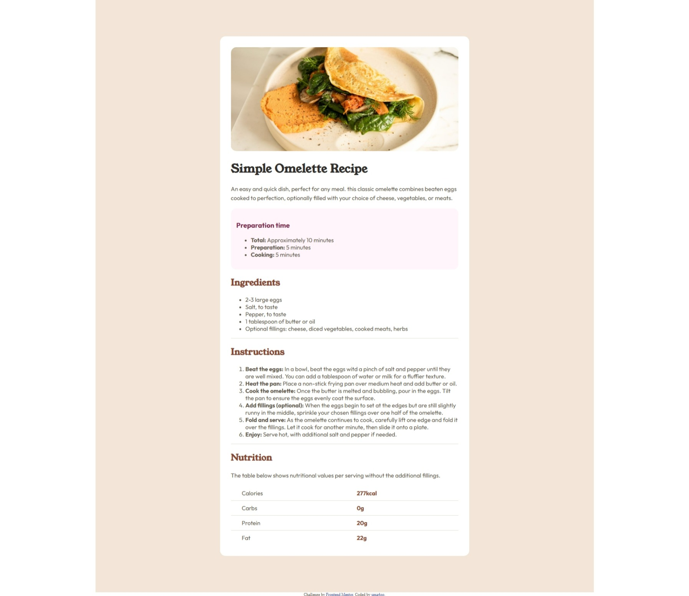

# Frontend Mentor - Recipe page solution

This is a solution to the [Recipe page challenge on Frontend Mentor](https://www.frontendmentor.io/challenges/recipe-page-KiTsR8QQKm). Frontend Mentor challenges help you improve your coding skills by building realistic projects. 

## Table of contents

- [Overview](#overview)
    - [Screenshot](#screenshot)
  - [Links](#links)
- [My process](#my-process)
  - [Built with](#built-with)
  - [What I learned](#what-i-learned)
  - [Continued development](#continued-development)
  - [Useful resources](#useful-resources)
  - [AI Collaboration](#ai-collaboration)
- [Author](#author)


## Overview

### Screenshot




### Links

- Solution URL: [Add solution URL here](https://your-solution-url.com)
- Live Site URL: [Add live site URL here](https://your-live-site-url.com)

## My process
I started by structuring the HTML content first, then added CSS styles. I worked from the top of the page downward, styling each section one at a time.
### Built with

- Semantic HTML5 markup
- CSS custom properties


### What I learned

Working on this project taught me a lot about responsive web design. I learned how to use media queries to adapt the layout for different screen sizes (mobile vs desktop), and I discovered how border-collapse works on tables to remove the default double borders.
One of my biggest challenges was making the layout responsive. I had set a fixed width on my container which broke the mobile view, and I learned how to fix this using media queries.


```css
@media (max-width: 480px) {
    .container{
        padding: 0px;
    }
    .box{
        width: 100%;
        padding: 0px;
        border-radius: 0px;
    }
}
```


### Continued development

I want to keep practicing responsive design and get more comfortable with CSS Flexbox and Grid. I also want to improve my understanding of semantic HTML and accessibility.

### Useful resources

- [MDN](https://developer.mozilla.org/en-US/docs/Web/CSS/Reference/Properties/border-collapse) - This helped me understand the border-collapse CSS property. I really liked this pattern and will use it going forward.
- [W3Schools](https://www.w3schools.com/css/css_rwd_mediaqueries.asp) - This is an amazing website which helped me finally understand media queries. I'd recommend it to anyone still learning this concept.


### AI Collaboration

- **Tool used:** Claude (claude.ai)
- **How I used it:** I used Claude to get guidance on CSS syntax (like border-bottom and border-collapse), understand responsive design concepts, and debug issues in my HTML and CSS files.Since I used it with AGENTS.md prompt it didn't just guide but also gave me brainstorming solutions
- **What worked well:** Getting clear explanations of concepts with examples relevant to my project.

## Author


- Frontend Mentor - [@uma4oo](https://www.frontendmentor.io/profile/uma4oo)


